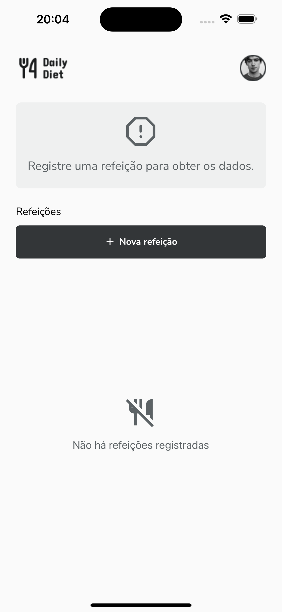
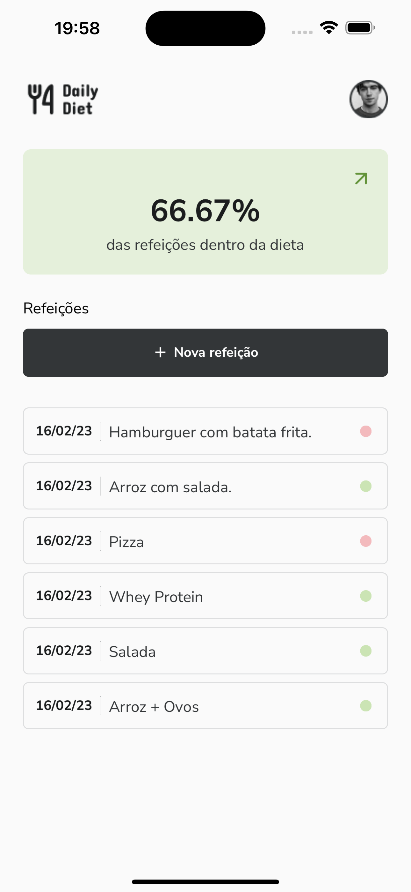
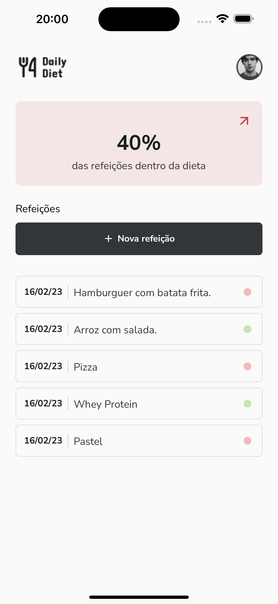

<h1 style="text-align: center; font-weight: bold;">Daily Diet</h1>

## Capa 📸

<div align="center" >
  
</div>

## Sobre o Projeto

O Daily Diet consiste em uma aplicação de monitoramento de dieta, onde o usuário cadastra todas as suas refeições e
aplicação informa como está o andamento da dieta dele.

### Tecnologias Usadas

- [React Native](https://reactnative.dev/)
- [Expo](https://expo.io/)
- [TypeScript](https://www.typescriptlang.org/)
- [Styled-components](https://styled-components.com/)
- [React Navigation](https://reactnavigation.org/)
- [Expo-Vector-Icons](https://icons.expo.fyi/)
- [Async Storage](https://react-native-async-storage.github.io/async-storage/)

### Como rodar a aplicação

```bash
# Clone este repositório
$ git clone https://github.com/marrcelosantana/daily-diet
# Acesse a pasta do projeto
$ cd daily-diet
# Instale as dependências
$ npm install
# ou
$ npm install
# Execute a aplicação em modo de desenvolvimento
$ expo start

```

### Telas da aplicação

|                  Home                  |              Home + List              |               Home + List               |
| :------------------------------------: | :-----------------------------------: | :-------------------------------------: |
|  |  |  |
